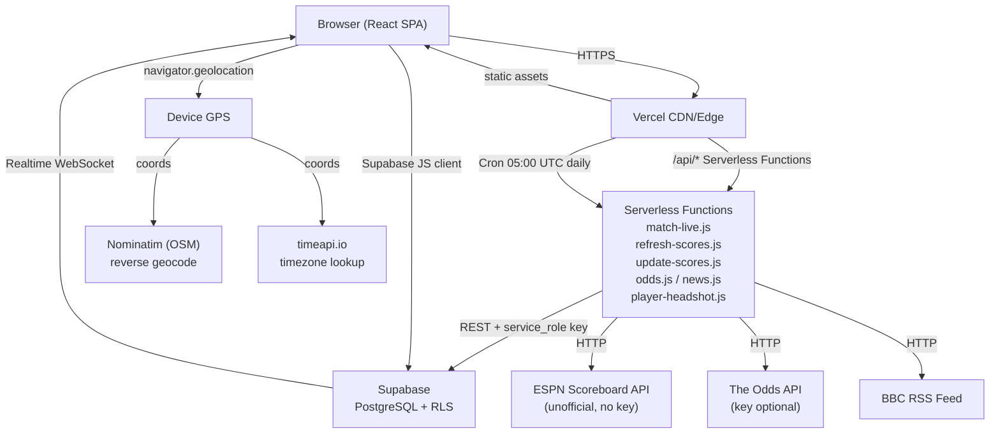

# PROJECT_BLUEPRINT.md — World Cup Companion App

> Last updated: 2026-06-20. Commits of record: `408da9e` (ESPN date-bucket fix), `740b9fd` (ProfileProvider context lift).

---

## 1. Executive Summary & Project Goals

The World Cup Companion App is a mobile-first, real-time fan engagement app for FIFA World Cup 2026. It allows authenticated fans to:

- Browse the full 48-team, 104-match group-stage and knockout schedule
- Submit and track score predictions before kickoff (locked at match start)
- Chat with other fans in per-match live chatrooms
- Follow a favorite team with a personalized "My Team" schedule filter
- View live match stats: possession, elapsed time, goals/cards timeline, shot heatmap
- See betting odds (cached from The Odds API, seeded as fallback)
- Browse team rosters with player profiles and headshots

Built as a take-home portfolio project for a Nasdaq interview. It is a functional, production-deployed MVP at the time of writing — not a prototype.

---

## 2. Technology Stack & Rationale

| Layer | Technology | Why |
|---|---|---|
| Frontend framework | React 18 + Vite + TypeScript | Fast HMR dev loop, strong types, large ecosystem |
| Styling | Tailwind CSS v3 | Utility-first, no runtime, fits mobile-first design velocity |
| Animation | Framer Motion | Spring physics for modal slide-ups and step transitions |
| Icons | Lucide React | Lightweight, consistent icon set |
| Router | React Router v6 | URL-based state (tab, search, group filters) for shareable deep links |
| Backend/DB | Supabase (PostgreSQL + Auth + Realtime) | Free tier, built-in auth + RLS + Realtime WebSocket — no separate backend server |
| Auth method | Magic link (Supabase Auth) | Zero-password UX; no custom SMTP configuration required for MVP |
| Serverless API | Vercel Functions (ESM .js) | Co-located with the SPA, no separate API deployment; free tier |
| Deployment | Vercel | Git-push deploy, CDN, cron support, SPA rewrite |
| Testing | Playwright (node runner, no browser) | HTTP-level API and database tests, no browser required |
| Live data | ESPN unofficial public scoreboard API | Free, no key required, covers all WC 2026 fixtures |
| Odds | The Odds API (with Supabase cache fallback) | Free tier available; app gracefully falls back to seeded data |
| News | BBC Sport RSS feed (server-side proxy) | No key required; proxied to avoid CORS |
| Player headshots | TheSportsDB API | No key required; graceful fallback to jersey-number avatar |
| Geo | Browser `navigator.geolocation` + Nominatim (OSM) | No key required; auto-suggests favorite team by country |
| Timezone | timeapi.io | No key required; used for local kickoff time display |

---

## 3. High-Level Architecture



**Key data flows:**

1. **Auth**: Browser → Supabase Auth magic link email → callback → SupabaseProvider session state
2. **Match list**: Browser → Supabase REST (`matches` + `predictions`) → `useMatches` → Realtime patch on UPDATE
3. **Live match data**: Browser → `/api/match-live` (Vercel Function) → ESPN scoreboard + summary → JSON
4. **Score sync**: `useScoreRefresh` → `/api/refresh-scores` → ESPN → Supabase PATCH → Realtime push to all clients
5. **Cron**: Vercel cron daily at 05:00 UTC → `/api/update-scores` → ESPN multi-day sweep → Supabase batch PATCH
6. **Chat**: Browser → Supabase INSERT (`messages`) → Realtime broadcast to all subscribers on that match channel

---

## 4. Project Directory Structure

```
worldcup-companion/
├── api/                        # Vercel serverless functions (ESM .js)
│   ├── match-live.js           # Unified ESPN live data: events, possession, elapsed, shots, stats
│   ├── refresh-scores.js       # Client-triggered score sync for a single match date
│   ├── update-scores.js        # Cron-called full sweep across all pending matches
│   ├── odds.js                 # The Odds API proxy + Supabase cache write
│   ├── news.js                 # BBC Sport RSS proxy (XML → JSON, 15-min CDN cache)
│   └── player-headshot.js      # TheSportsDB headshot lookup by player name
├── src/
│   ├── components/             # Reusable UI components
│   │   ├── BottomNav.tsx       # 3-tab persistent navigation (Schedule / Profile)
│   │   ├── Layout.tsx          # Page wrapper with safe-area padding + BottomNav
│   │   ├── LiveTimer.tsx       # Elapsed clock: uses ESPN elapsed prop or local interval
│   │   ├── MatchCard.tsx       # Schedule list/grid card with score, status, prediction indicator
│   │   ├── MatchTimeline.tsx   # Goals/cards event feed with minute and player
│   │   ├── NewsTicker.tsx      # Horizontally scrolling BBC news headline strip
│   │   ├── OddsDisplay.tsx     # Decimal odds bars (home/draw/away + over 2.5)
│   │   ├── OnboardingModal.tsx # 2-step signup flow (name+username → country+team)
│   │   ├── PossessionBar.tsx   # Horizontal possession percentage visualization
│   │   ├── ShotHeatmap.tsx     # Full-pitch SVG shot map (dual goal, per-side orientation)
│   │   └── WelcomeModal.tsx    # One-time 4-second welcome screen on first login
│   ├── data/
│   │   └── rosters.ts          # Static 48-team WC 2026 roster data (name, position, club, number)
│   ├── hooks/
│   │   ├── useChat.ts          # Messages fetch + Realtime subscription + send
│   │   ├── useGeoLocation.ts   # GPS → Nominatim country code + timeapi.io timezone
│   │   ├── useMatch.ts         # Single match + user prediction + savePrediction (upsert)
│   │   ├── useMatches.ts       # All matches + user predictions + Realtime match UPDATE patch
│   │   ├── useMatchEvents.ts   # (Type source only) MatchEvent + MatchEventData types
│   │   ├── useMatchLive.ts     # Polls /api/match-live every 60s; pauses when tab hidden
│   │   ├── useMatchOdds.ts     # Reads odds from match record; triggers /api/odds POST refresh
│   │   ├── useMatchShots.ts    # (Type source only) Shot + ShotStats types
│   │   ├── useNews.ts          # Fetches /api/news on mount; 15-min revalidation
│   │   ├── useProfile.ts       # Re-exports useProfileContext — single shared profile state
│   │   └── useScoreRefresh.ts  # Fires /api/refresh-scores on mount + every 5 min while live
│   ├── lib/
│   │   ├── database.types.ts   # TypeScript types for all Supabase tables + convenience aliases
│   │   ├── supabaseClient.ts   # Singleton Supabase client (anon key, env vars)
│   │   └── utils.ts            # deriveStatus, isLocked, teamFlag, WC_TEAM_BY_COUNTRY, scoring
│   ├── pages/
│   │   ├── AuthPage.tsx        # Magic link email form; redirects to `from` after sign-in
│   │   ├── MatchPage.tsx       # Full match detail: hero, odds, timeline, heatmap, prediction, chat
│   │   ├── ProfilePage.tsx     # Edit profile form + sign out
│   │   ├── SchedulePage.tsx    # Main hub: tabs, search, group filters, date strip, match cards
│   │   └── TeamPage.tsx        # Roster browser with player modal (headshot + stats)
│   ├── providers/
│   │   ├── ProfileProvider.tsx # Shared profile state context (single Supabase fetch for whole app)
│   │   └── SupabaseProvider.tsx# Session + user context; single auth.getSession + onAuthStateChange
│   ├── App.tsx                 # Provider tree, route config, OnboardingGate
│   ├── index.css               # Tailwind base + custom CSS variables (wc-dark, wc-gold, wc-surface)
│   └── main.tsx                # React DOM root
├── supabase/
│   └── migrations/             # SQL migration files (applied in order by filename date)
│       ├── 20260616000000_phase0_initial.sql
│       ├── 20260617000000_phase1_matches_chat.sql
│       ├── 20260618000000_onboarding_complete.sql
│       ├── 20260619000000_odds_columns.sql
│       ├── 20260620000000_phase6_full_schedule.sql
│       ├── 20260621000000_phase8_events_shots.sql
│       └── 20260622000000_reseed_group_stage_odds.sql
├── tests/                      # Playwright HTTP/API test suites
│   ├── phase1-predictions.mjs
│   ├── phase2-chat.mjs
│   ├── phase3-schedule.mjs
│   ├── phase4-onboarding.mjs
│   ├── phase5-odds.mjs
│   ├── phase6-schedule-hub.mjs
│   └── phase8-live-features.mjs
├── scripts/
│   ├── migrate.mjs             # CLI tool to run SQL migrations against Supabase REST
│   └── migrate-phase6.mjs      # Phase 6 full schedule seed
├── vercel.json                 # SPA rewrite + daily cron config
└── package.json
```

---

## 5. Core Features & User Flows

### 5.1 Authentication (Magic Link)

```
User enters email → AuthPage → supabase.auth.signInWithOtp()
→ Email sent → User clicks link → Supabase redirects to /
→ SupabaseProvider.onAuthStateChange fires → session set
→ If new user: handle_new_user() DB trigger creates profiles row
→ OnboardingGate detects !onboarding_complete → shows WelcomeModal
```

### 5.2 Onboarding (2-step modal)

```
Step 1: Full name + username (debounced uniqueness check)
Step 2: Country (geo pre-filled) + Favorite team (geo-suggested)
→ updateProfile({ ..., onboarding_complete: true })
→ ProfileProvider shared state updates immediately
→ SchedulePage "My Team" tab populates without page reload
```

### 5.3 Schedule (Main Hub)

```
SchedulePage loads → useMatches() fetches all matches + user predictions in parallel
→ Realtime subscription patches individual match rows on UPDATE
→ Tabs: Today (live + today's date) | My Team (filtered by favorite_team) | Upcoming | All
→ Group/round filter chips, full-text search (URL-persisted via ?tab=&group=&q=)
→ Date strip scrolls to nearest active date; clicking a date scrolls the match list
→ "Relevant for You" section on All tab shows next 3 favorite-team matches
→ deriveStatus() applied client-side: past 2h window = finished regardless of DB status
```

### 5.4 Match Page

```
/match/:id → useMatch(id) + useChat(id) + useMatchLive(id, status) + useScoreRefresh(id, status)

On mount (live or finished):
  useScoreRefresh → GET /api/refresh-scores → ESPN → PATCH Supabase → Realtime push
  useMatchLive → GET /api/match-live → ESPN scoreboard + summary → events/shots/possession

Live polling (60s interval, pauses when tab hidden):
  useMatchLive refetches /api/match-live

Prediction form:
  Locked (isLocked) when starts_at ≤ now()
  DB-level RLS enforces the same constraint server-side
  savePrediction → upsert with onConflict: 'user_id,match_id'
  scorePrediction() computes exact (3pts) / correct (1pt) / wrong after match

Chat:
  Initial load of 200 messages ordered by created_at asc
  Realtime INSERT subscription appends new messages with dedup
  Auto-scroll to bottom on new messages
```

### 5.5 Team Page

```
/team/:teamName → looks up ROSTERS[teamName] from static rosters.ts
→ Grouped by position (GK/DEF/MID/FWD)
→ Tap player → PlayerModal → fetches /api/player-headshot?name=...
→ Falls back to jersey-number avatar circle on 404
→ Wikipedia link for full bio
```

### 5.6 Profile Page

```
/profile → useProfile() (shared context) → form pre-populated
→ Geo suggestion shown if team not set
→ updateProfile() → Supabase PATCH → shared state updates everywhere
→ Sign out → supabase.auth.signOut() → SupabaseProvider clears session → redirect /auth
```

---

## 6. Key Architectural Decisions & Trade-offs

| Decision | Rationale | Trade-off |
|---|---|---|
| Supabase Realtime for chat + score updates | Zero extra infrastructure; built-in WebSocket | Free tier connection limits (200 concurrent); no message history pagination beyond 200 |
| ESPN unofficial API (no key) | Free, no rate limit key management | Undocumented; could break; name mismatches require `ESPN_NAME_MAP` mapping table |
| `deriveStatus()` client-side | Matches show as `live` immediately at kickoff without waiting for cron | 2h window is approximate; extra-time/penalties matches will "auto-finish" at 2h |
| Static roster data (`rosters.ts`) | No external API dependency; zero latency | Must be manually updated for squad changes; 48 teams × ~23 players = ~1100 rows |
| Odds cached in Supabase `matches.odds` | App works without Odds API key; 1 API call refreshes cache | Stale if nobody visits a match page; no background odds refresh |
| Match-live unified endpoint | Single ESPN round-trip per poll instead of two separate endpoints | Slightly larger response; shot commentary parsing is zone-approximated, not exact |
| ProfileProvider context | All call sites share one fetch; onboarding update propagates instantly | Must be mounted inside SupabaseProvider; throws if used outside |
| URL-persisted schedule filters | Tab/search/group state survives back navigation; shareable links | Adds URL parameter management complexity in SchedulePage |

---

## 7. State Management Strategy

The app uses **no global state library** (no Redux, Zustand, Jotai). State is managed at three levels:

### 7.1 React Context (App-wide singletons)

```
App
└── SupabaseProvider       session, user, loading (auth state)
    └── ProfileProvider    profile, updateProfile (shared across all pages)
        └── BrowserRouter
            ├── AppRoutes  (pages)
            └── OnboardingGate
```

Both contexts are **mounted once** and never re-created during the session. This means:
- Auth state and profile state are stable references.
- `updateProfile()` in `OnboardingModal` writes to the same `ProfileProvider` instance that `SchedulePage` reads from — no stale data.

### 7.2 Hook-local state (per page/component)

Each page manages its own data via hooks (`useMatches`, `useMatch`, `useChat`, `useMatchLive`). These are **independent instances** — navigating to a new match page creates fresh hook state.

### 7.3 URL state (SchedulePage only)

Tab, search query, group filter, and view mode are stored in `useSearchParams()`. This means:
- Browser back/forward works correctly.
- Deep links like `/?tab=myteam&group=C` are shareable.
- The schedule page never uses `useState` for these filter values.

### 7.4 Optimistic updates

Both `useMatch.savePrediction()` and `ProfileProvider.updateProfile()` apply optimistic updates immediately and rollback on error. This gives instant UI feedback without waiting for the network round-trip.

---

## 8. Recent Fixes & Known Limitations

### Fix 1 — ESPN Date-Bucket Bug (`api/match-live.js`, commit `408da9e`)

**Problem**: Matches kicking off between 00:00–05:59 UTC (late evening ET) had no events/shots/possession data on their match pages. Brazil vs Haiti (01:00 UTC June 20 = 9 PM ET June 19) showed a 3-0 score but blank timeline and heatmap.

**Root cause**: ESPN's scoreboard API indexes matches by US-ET local date, not UTC. The function was computing `dateStr` from `match.starts_at` UTC (e.g. `20260620`), but ESPN filed the game under `20260619`.

**Fix**: `match-live.js` now tries `dateUTC` first, then retries `dateUTC - 1 day` if no matching event is found. The retry adds at most one extra ESPN network call.

**Scope**: Affected 4 already-played matches (Saudi Arabia/Uruguay, Austria/Jordan, Mexico/South Korea, Brazil/Haiti) and would impact 20 more upcoming fixtures.

### Fix 2 — ProfileProvider Context Lift (`src/providers/ProfileProvider.tsx`, commit `740b9fd`)

**Problem**: After completing onboarding and selecting a favorite team, the Schedule page still showed "My Team" as empty and the team banner was blank — until a manual page reload.

**Root cause**: `OnboardingGate` (in `App.tsx`) and `SchedulePage` each called `useProfile()` independently, creating two separate Supabase fetch instances with isolated state. The modal updated one; the schedule page kept its stale copy.

**Fix**: Lifted profile state into `ProfileProvider` context. `useProfile.ts` is now a one-line re-export of `useProfileContext`. All four call sites (`App.tsx`, `SchedulePage`, `MatchPage`, `ProfilePage`) share a single instance.

### Known Limitations

- **Prediction locking is time-based only**: `isLocked()` checks `starts_at ≤ now()`. If a match is delayed, predictions would still lock at the original kickoff time. DB-level RLS uses the same `starts_at` check.
- **`deriveStatus()` uses a fixed 2-hour window**: Matches in extra time or penalties will transition to `finished` in the client UI at `starts_at + 2h` even if still live. The DB `status` column is the authoritative source once updated by the cron.
- **Roster data is static and manually maintained**: Any squad change requires an update to `src/data/rosters.ts`.
- **ESPN name mapping is a lookup table**: New team name mismatches between ESPN and the DB require manual additions to `ESPN_NAME_MAP` in both `match-live.js` and `refresh-scores.js`.
- **Cron runs once daily at 05:00 UTC**: Scores from games after 05:00 UTC on a given day won't be in the DB until the next day's cron — unless a user visits the match page (which triggers `refresh-scores`).
- **No message deletion UI**: Users can delete their messages via the DB (RLS policy exists) but there's no UI affordance for it.
- **No score leaderboard**: `scorePrediction()` calculates per-match points but there's no aggregated leaderboard view.

---

## 9. Security & Data Access Controls

All tables have RLS enabled. The client uses the **anon key** (safe to expose). The **service role key** is only used server-side in Vercel Functions.

| Table | SELECT | INSERT | UPDATE | DELETE |
|---|---|---|---|---|
| `profiles` | Any authenticated user | Never (trigger only) | Own row only | Never |
| `matches` | Any authenticated user | Never | Never (service key only) | Never |
| `predictions` | Any authenticated user | Own rows, `starts_at > now()` only | Own rows, `starts_at > now()` only | Own rows |
| `messages` | Any authenticated user | Own rows | Never | Own rows |
| `match_events` | Any authenticated user | Never | Never | Never |
| `match_shots` | Any authenticated user | Never | Never | Never |

**Critical**: Prediction insert/update RLS checks `starts_at > now()` at the database level. Even if the client bypasses the `isLocked()` check, the DB will reject the write after kickoff.

---

## 10. Environment Variables

```env
# Required — set in Vercel dashboard and locally in .env
VITE_SUPABASE_URL=https://cxklsqbtmhxapebaqrlh.supabase.co
VITE_SUPABASE_ANON_KEY=eyJ...          # Safe to expose (anon key)

# Required for serverless functions — Vercel env only, never in .env.local
SUPABASE_URL=https://cxklsqbtmhxapebaqrlh.supabase.co
SUPABASE_SERVICE_KEY=eyJ...            # NEVER expose to client
CRON_SECRET=...                        # Protects /api/update-scores from unauthorized calls

# Optional — app degrades gracefully without these
ODDS_API_KEY=...                       # The Odds API key; falls back to Supabase cache
```

**Local development**: Copy `.env.example` to `.env`. The `VITE_` prefixed vars are used by Vite for the browser bundle. The non-prefixed vars are for the Vercel Functions (use `vercel dev` locally, which injects them from Vercel dashboard).

---

## 11. Local Development Setup

```bash
# 1. Install deps
npm install

# 2. Set up environment
cp .env.example .env
# Fill in VITE_SUPABASE_URL and VITE_SUPABASE_ANON_KEY

# 3. Start dev server (Vite only, no serverless functions)
npm run dev

# 4. Start with serverless functions (requires Vercel CLI)
npx vercel dev

# 5. Run migrations (requires SUPABASE_SERVICE_KEY in environment)
SUPABASE_SERVICE_KEY=... npm run migrate

# 6. Type-check
npm run build    # tsc && vite build
```

---

## 12. Deployment Process (Vercel)

The project is linked to Vercel via `.vercel/repo.json` (pointing to `Hyperfragalistic/worldcup-companion` on GitHub).

```bash
# Deploy is automatic on push to main:
git push origin main

# Manual deploy:
npx vercel --prod

# Trigger cron manually (requires CRON_SECRET):
curl "https://worldcup-companion.vercel.app/api/update-scores?secret=<CRON_SECRET>"
```

**Cron**: `vercel.json` configures `/api/update-scores` at `0 5 * * *` (05:00 UTC daily). Vercel sends an `x-vercel-cron` header, which the handler accepts as authentication.

**SPA rewrite**: `"source": "/((?!api/).*)","destination": "/index.html"` — all non-API paths serve `index.html` so React Router handles client-side navigation.

---

## 13. Running Tests

Tests require a live Supabase instance and a test user. All tests use HTTP against the production or staging URL.

```bash
# Required env vars
export SUPABASE_URL=https://cxklsqbtmhxapebaqrlh.supabase.co
export SUPABASE_SERVICE_KEY=eyJ...
export TEST_USER_EMAIL=test@example.com
export BASE_URL=https://worldcup-companion.vercel.app  # or http://localhost:5173

# Run individual phase suites
npm run test:phase1    # predictions CRUD + locking
npm run test:phase2    # chat send + realtime
npm run test:phase3    # schedule filters + deriveStatus
npm run test:phase4    # onboarding flow + profile persistence
npm run test:phase5    # odds display + cache
npm run test:phase6    # schedule hub tabs + group filters
npm run test:phase8    # live features: /api/match-live, possession, shots

# Phase 8 with output capture
bash scripts/run-phase8.sh
```

Each suite is a standalone Node.js ESM script using `playwright` for HTTP testing. No browser is launched. Tests create/clean their own data using the service key.
